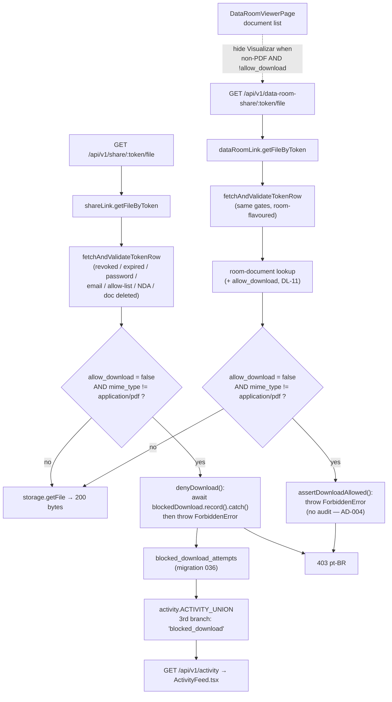

# Enforce allow_download Server-Side — Design

**Spec**: `.specs/features/enforce-allow-download/spec.md`
**Status**: Draft
**Sizing**: Large
**Prior decisions honored**: AD-001 (PDF out of scope), AD-002 ("Visualizar" bypass in scope), AD-003 (persistence schema decided here), AD-004 (data-room events excluded from the Activity Feed)
**New decisions**: AD-005 … AD-008 (appended to `.specs/STATE.md`)

---

## Architecture Overview

Three independent slices, all built out of patterns this repo already uses:

1. **Enforcement** — a named `assert`-style guard in each of the two link models,
   called from `getFileByToken` only (never from the shared
   `fetchAndValidateTokenRow`). Throws `ForbiddenError`; `infra/controller.ts`
   already turns that into a `403` with pt-BR `message`/`action`. **Both HTTP
   routes are unchanged** — no new params, no new response shape, no business
   logic leaking into `pages/`.
2. **Audit** — a new append-only table `blocked_download_attempts` and a new
   single-function model `models/blockedDownload.ts`. Written from the
   share-link deny path only (AD-004/DL-17), best-effort (DL-13).
3. **Surfacing** — a third `SELECT` branch in `models/activity.ts`'s
   `ACTIVITY_UNION`, plus the matching `event_type` widening in
   `types/index.ts` and a rendering branch in `components/activity/ActivityFeed.tsx`.



---

## Approach Exploration

### Decision 1 — where the blocked attempt is persisted (AD-003 resolves here)

| Approach                                                             | Trade-offs                                                                                                                                                                                                                                                                                                                                                                       |
| -------------------------------------------------------------------- | -------------------------------------------------------------------------------------------------------------------------------------------------------------------------------------------------------------------------------------------------------------------------------------------------------------------------------------------------------------------------------- |
| **A. New table `blocked_download_attempts` (RECOMMENDED)**           | Self-contained, append-only, immutable by construction (DL-18). Works for a bare `curl` that never called `POST /view`, which is the exact case the spec identified. Costs one migration and one 12-line model. Mirrors `rate_limit_log` / `data_room_link_views` — both introduced as their own table for the same reason.                                                      |
| B. Column(s) on `link_views` (the way `downloaded` was added in 018) | Rejected. A blocked attempt frequently has **no** `link_views` row (`/file` is reachable without ever calling `POST /view`), so the model would have to _invent_ a synthetic view row to hang the flag on — inflating `total_views`, `unique_viewers`, `views_by_day` and the engagement score for every blocked probe. That corrupts existing analytics to store an audit fact. |
| C. Generic `events` table (one table, `event_type` discriminator)    | Rejected. Would be the first generic-event table in a schema that is consistently one-table-per-concept, and `models/activity.ts` would still need a `UNION ALL` for `view`/`link_created`, which stay in their own tables. Big refactor, zero benefit to this increment.                                                                                                        |

### Decision 2 — where the `allow_download` / mime check goes

| Approach                                                                     | Trade-offs                                                                                                                                                                                                                                                                                                                              |
| ---------------------------------------------------------------------------- | --------------------------------------------------------------------------------------------------------------------------------------------------------------------------------------------------------------------------------------------------------------------------------------------------------------------------------------- |
| **A. Guard inside `getFileByToken`, after the existing gates (RECOMMENDED)** | Routes untouched (`pages/` stays HTTP-only per `CLAUDE.md`). Ordering requirement DL-04/DL-11 is satisfied structurally: `fetchAndValidateTokenRow` has already run and thrown. Mirrors the existing `assertLinkIsActiveAndNotExpired` helper convention already present in _both_ models.                                              |
| B. Guard inside `fetchAndValidateTokenRow`                                   | **Rejected — would be a functional regression.** That helper is also the sole validator for `getByToken`, which backs `GET /api/v1/share/:token` (the viewer page's metadata call). A non-PDF, view-only link would 403 on page load and show "Link não encontrado"-class errors instead of the "Pré-visualização não disponível" card. |
| C. Model returns `allow_download`, route decides                             | Rejected. Puts a business rule in `pages/api/`, contradicting `CLAUDE.md`'s layering rule, and would have to be written twice (once per route).                                                                                                                                                                                         |

---

## Code Reuse Analysis

### Existing components to leverage

| Component                                                            | Location                                                                             | How to use                                                                                                                                       |
| -------------------------------------------------------------------- | ------------------------------------------------------------------------------------ | ------------------------------------------------------------------------------------------------------------------------------------------------ |
| `ForbiddenError`                                                     | `infra/errors.ts:127`                                                                | Already imported in both link models. `403` + pt-BR `message`/`action` (DL-05).                                                                  |
| `controller.errorHandlers` → `onErrorHandler`                        | `infra/controller.ts:45`                                                             | Already maps `ForbiddenError` → `403` JSON. **No route change needed** for either endpoint.                                                      |
| `assertLinkIsActiveAndNotExpired`                                    | `models/shareLink.ts:131`, `models/dataRoomLink.ts:94`                               | Naming/shape precedent for the new `assertDownloadAllowed` / `denyDownload` guards.                                                              |
| `fetchAndValidateTokenRow`                                           | `models/shareLink.ts:590`, `models/dataRoomLink.ts:363`                              | Already runs every prior gate in its existing order — reused untouched, which is what makes DL-04/DL-11 free.                                    |
| `database.query<T>({ text, values })`                                | `infra/database.ts`                                                                  | Parameterized INSERT in the new model; parameterized `$1` workspace filter in the activity UNION.                                                |
| `.catch(() => undefined)` best-effort idiom                          | `pages/api/v1/documents/index.ts:102`, `pages/api/v1/share/[token]/view/index.ts:71` | Same swallow-the-failure contract for the audit write (DL-13). See AD-007 for the one deliberate refinement.                                     |
| `ACTIVITY_UNION` + explicit `NULL::type` casts                       | `models/activity.ts:15`                                                              | Third branch copies the existing column list and cast convention exactly (DL-15).                                                                |
| `set_updated_at()` trigger                                           | `infra/migrations/032`                                                               | **Deliberately not applied** — the new table has no `updated_at` (append-only, DL-18), same as `rate_limit_log` and `share_link_allowed_emails`. |
| `ViewerPage`'s non-PDF CTA gate                                      | `components/viewer/ViewerPage.tsx:420-428`                                           | The exact convention `DataRoomViewerPage` must mirror for DL-09.                                                                                 |
| `orchestrator.createShareLink` / `createDataRoom` / `uploadDocument` | `tests/orchestrator.ts:115,153,190`                                                  | Fixtures for every new test; `createShareLink` already accepts `allow_download`, `createDataRoom` accepts per-document `allow_download`.         |

### Integration points

| System                              | Integration method                                                                                                                                                                              |
| ----------------------------------- | ----------------------------------------------------------------------------------------------------------------------------------------------------------------------------------------------- |
| `share_links`, `documents`          | FK targets of the new table; also the JOIN path the activity branch uses to reach `documents.workspace_id`.                                                                                     |
| `GET /api/v1/activity`              | Unchanged route/handler — it just gets more rows because `ACTIVITY_UNION` grew a branch.                                                                                                        |
| `infra/rate-limit.ts` (20 req/60 s) | Already applied to both `/file` routes; now also bounds how many audit rows one source can create per minute (spec Edge Cases, DL-12).                                                          |
| Storage (S3/MinIO)                  | **Never reached** on a blocked request — the throw happens before `storage.getFile`, which is what makes "SHALL NOT include the file bytes" (DL-01/DL-06) true rather than merely status-coded. |

---

## Components

### 1. Migration `036-create-blocked-download-attempts.sql`

- **Purpose**: append-only audit table for blocked share-link download attempts.
- **Location**: `infra/migrations/036-create-blocked-download-attempts.sql`
- **Requirements**: DL-12, DL-16, DL-18
- **Reuses**: `link_views` (007) column/index conventions; `rate_limit_log` (033) append-only shape.

```sql
-- Create blocked_download_attempts table
-- Migration: 036-create-blocked-download-attempts.sql

-- One row per request that was refused by the server-side allow_download
-- check on GET /api/v1/share/[token]/file. Deliberately its own table
-- rather than a column on link_views (the way `downloaded` was added in
-- 018): a blocked attempt routinely has no link_views row at all — the
-- file endpoint is reachable by a bare curl that never calls POST /view —
-- so hanging the flag on link_views would mean inventing a synthetic view
-- row and inflating every view/engagement metric derived from that table.
--
-- Append-only: no updated_at and no set_updated_at() trigger. A persisted
-- attempt is immutable history; later flipping the link's allow_download
-- back on must not alter or remove it.
--
-- Share-link only in this increment — data-room blocked attempts are
-- refused with the same 403 but not recorded, because the activity feed
-- has no data-room representation for any event type yet.
CREATE TABLE blocked_download_attempts (
    id UUID PRIMARY KEY DEFAULT gen_random_uuid(),
    -- same cascade rationale as link_views: a hard-deleted link takes its
    -- history with it (links are revoked, never DELETEd, in practice)
    share_link_id UUID NOT NULL REFERENCES share_links(id) ON DELETE CASCADE,
    -- stored explicitly, not derived through share_links.document_id, so
    -- the record stays self-describing regardless of later schema changes
    document_id UUID NOT NULL REFERENCES documents(id),
    -- only what the file endpoint actually receives (X-Viewer-Email /
    -- X-Viewer-Name); NULL for an anonymous request
    viewer_email VARCHAR(254),
    viewer_name VARCHAR(255),
    created_at TIMESTAMPTZ NOT NULL DEFAULT timezone('utc', now())
);

CREATE INDEX blocked_download_attempts_share_link_id_idx ON blocked_download_attempts (share_link_id);
CREATE INDEX blocked_download_attempts_created_at_idx ON blocked_download_attempts (created_at);
```

**Why no `viewer_fingerprint` / `ip_address` / `user_agent`**: the fingerprint is
computed client-side and only ever sent in the `POST /view` **body** — no
`X-Viewer-Fingerprint` header exists anywhere in the codebase (verified across
`pages/`, `components/`, `lib/`), so the column would be permanently `NULL`.
`ip_address`/`user_agent` are HTTP-layer facts; capturing them would mean
threading two more positional parameters through `getFileByToken`'s already
4-/5-argument signature, and DL-12 does not ask for them. Both are additive,
non-breaking follow-ups if wanted later. (AD-005)

### 2. `models/blockedDownload.ts` (new)

- **Purpose**: persist one blocked-download attempt. Single responsibility, so the audit write is not bolted onto `shareLink.ts`.
- **Location**: `models/blockedDownload.ts`
- **Requirements**: DL-12, DL-16
- **Interfaces**:
  - `record(input: BlockedDownloadCreateInput): Promise<BlockedDownloadAttempt>`
- **Dependencies**: `infra/database`, `types/index`
- **Reuses**: `models/linkView.ts#insertView`'s INSERT-with-`RETURNING` shape and `COLUMNS` constant convention; default-exported typed object per `CLAUDE.md`.

```ts
const BLOCKED_DOWNLOAD_COLUMNS = `
  id, share_link_id, document_id, viewer_email, viewer_name, created_at
`;

async function record(
  input: BlockedDownloadCreateInput,
): Promise<BlockedDownloadAttempt> {
  const results = await database.query<BlockedDownloadAttempt>({
    text: `
        INSERT INTO
          blocked_download_attempts (
            share_link_id, document_id, viewer_email, viewer_name
          )
        VALUES
          ($1, $2, $3, $4)
        RETURNING
          ${BLOCKED_DOWNLOAD_COLUMNS}
        ;`,
    values: [
      input.share_link_id,
      input.document_id,
      input.viewer_email ?? null,
      input.viewer_name ?? null,
    ],
  });

  return results.rows[0]!;
}

const blockedDownload: BlockedDownloadModel = { record };

export default blockedDownload;
```

`record` **throws** on failure; swallowing happens at the call site
(`.catch(() => undefined)`), matching the repo's existing best-effort idiom and
keeping the "this is deliberately best-effort" decision visible where the
security response is produced.

### 3. `models/shareLink.ts` — enforcement + deny path

- **Purpose**: refuse non-PDF downloads on a `allow_download: false` link, and record the attempt.
- **Location**: `models/shareLink.ts`
- **Requirements**: DL-01, DL-02, DL-03, DL-04, DL-05, DL-12, DL-13, DL-16
- **Dependencies**: new import of `./blockedDownload` (no cycle: `blockedDownload` imports only `infra/database`)

Add near the other module constants:

```ts
// AD-001: enforcement is scoped to non-PDF documents. Both viewers fetch
// this same endpoint to render a PDF inline, so blocking PDFs here would
// break viewing on every "view-only" link.
const PDF_MIME_TYPE = "application/pdf";
```

Add next to `assertLinkIsActiveAndNotExpired` (same naming family):

```ts
// Records the refused attempt, then blocks. Best-effort by design: a
// failed audit write is swallowed so the 403 is returned either way — the
// security block must never depend on the audit log succeeding (DL-13).
// Awaited rather than left dangling; see AD-007.
async function denyDownload(
  row: ShareLinkTokenRow,
  providedEmail?: string,
  providedName?: string,
): Promise<never> {
  await blockedDownload
    .record({
      share_link_id: row.link_id,
      document_id: row.document_id,
      ...(providedEmail !== undefined && { viewer_email: providedEmail }),
      ...(providedName !== undefined && { viewer_name: providedName }),
    })
    .catch(() => undefined);

  throw new ForbiddenError({
    message: "O download deste arquivo não está habilitado para este link.",
    action:
      "Peça ao proprietário do documento para habilitar o download, se necessário.",
  });
}
```

`getFileByToken` becomes:

```ts
async function getFileByToken(
  token: string,
  providedPassword?: string,
  providedEmail?: string,
  providedName?: string,
): Promise<{ storage_key: string; mime_type: string }> {
  // Every prior gate (revoked, expired, password, email/allow-list, NDA,
  // deleted document) has already run and thrown in its existing order —
  // that ordering requirement (DL-04) is why this check lives here and not
  // inside fetchAndValidateTokenRow, which getByToken also uses.
  const row = await fetchAndValidateTokenRow(
    token,
    providedPassword,
    providedEmail,
    providedName,
  );

  if (!row.allow_download && row.mime_type !== PDF_MIME_TYPE) {
    await denyDownload(row, providedEmail, providedName);
  }

  return { storage_key: row.storage_key, mime_type: row.mime_type };
}
```

No signature change, no return-shape change → `pages/api/v1/share/[token]/file/index.ts`
is **untouched**. `ShareLinkModel.getFileByToken` in `types/index.ts` is unchanged.

**Conditional-spread note**: `tsconfig` has `exactOptionalPropertyTypes: true`, so
optional fields are added with `...(x !== undefined && { k: x })` — the same form
already used in `pages/api/v1/share/[token]/view/index.ts:38-62`.

### 4. `models/dataRoomLink.ts` — enforcement parity (no audit)

- **Purpose**: same refusal for the data-room file endpoint.
- **Location**: `models/dataRoomLink.ts`
- **Requirements**: DL-06, DL-07, DL-08, DL-10, DL-11, DL-17
- **Dependencies**: none new — `ForbiddenError` is already imported.

Two changes inside `getFileByToken` (the room/document validation query already
there is what satisfies DL-11 and is left in place):

1. Select the per-document flag the function currently omits:

```sql
        SELECT
          documents.storage_key,
          documents.mime_type,
          data_room_documents.allow_download
        FROM
          data_room_documents
        JOIN
          documents ON documents.id = data_room_documents.document_id
        WHERE
          data_room_documents.data_room_id = $1
          AND data_room_documents.document_id = $2
          AND documents.deleted_at IS NULL
        LIMIT
          1
        ;
```

(row type widens to `{ storage_key: string; mime_type: string; allow_download: boolean }`)

2. Guard after the not-found check, before returning:

```ts
const documentRow = results.rows[0]!;

assertDownloadAllowed(documentRow);

return {
  storage_key: documentRow.storage_key,
  mime_type: documentRow.mime_type,
};
```

with a module-level guard mirroring `shareLink.ts`'s, minus the audit write
(AD-004/DL-17):

```ts
// Same rule as shareLink.ts#getFileByToken, minus the audit write: a
// data-room blocked attempt is refused but not persisted this increment,
// because models/activity.ts has no data-room representation for any
// event type yet (AD-004).
function assertDownloadAllowed(row: {
  allow_download: boolean;
  mime_type: string;
}): void {
  if (!row.allow_download && row.mime_type !== PDF_MIME_TYPE) {
    throw new ForbiddenError({
      message: "O download deste arquivo não está habilitado para este link.",
      action:
        "Peça ao proprietário da data room para habilitar o download, se necessário.",
    });
  }
}
```

Duplicating the small guard (and the `PDF_MIME_TYPE` constant) across the two
models rather than extracting a shared helper follows this repo's own precedent:
`assertLinkIsActiveAndNotExpired`, `replaceAllowedEmails`, `getAllowedEmails`,
`toResponse` and `findLinkRow` are all already duplicated between these two
files, each with its own document-vs-room pt-BR wording. (AD-006)

The route (`pages/api/v1/data-room-share/[token]/file/index.ts`) is **untouched**;
`DataRoomLinkModel.getFileByToken` in `types/index.ts` is unchanged.

### 5. `models/activity.ts` — third UNION branch

- **Purpose**: surface persisted blocked attempts in the workspace feed.
- **Location**: `models/activity.ts` (`ACTIVITY_UNION`)
- **Requirements**: DL-14, DL-15, DL-16, DL-18
- **Reuses**: the exact 12-column shape and `NULL::type` cast convention of the existing two branches.

Appended to `ACTIVITY_UNION`:

```sql
  UNION ALL

  SELECT
    'blocked_download' AS event_type,
    bda.id,
    d.id AS document_id,
    d.title AS document_title,
    bda.viewer_name AS actor_name,
    bda.viewer_email AS actor_email,
    sl.label AS link_label,
    NULL::int AS pages_viewed,
    NULL::int AS page_count,
    NULL::int AS time_on_page,
    false AS is_revisit,
    bda.created_at
  FROM
    blocked_download_attempts bda
  JOIN
    share_links sl ON sl.id = bda.share_link_id
  JOIN
    documents d ON d.id = bda.document_id
  WHERE
    d.workspace_id = $1
```

Type alignment (why the casts land): `actor_name`/`actor_email` are
`VARCHAR(255)`/`VARCHAR(254)` in `blocked_download_attempts`, matching
`link_views.viewer_name`/`viewer_email` in branch 1 and the `NULL::varchar`
casts in branch 2. `link_label` is `share_links.label VARCHAR(255)`, matching
branch 2 (branch 1 casts it `NULL::varchar`). `is_revisit` uses a bare `false`
literal exactly as branch 2 does — it is not a meaningful concept for this
event type (DL-15).

`findAllByWorkspaceId` itself needs **no change**: both the page query and the
count query already wrap `ACTIVITY_UNION` and apply `ORDER BY created_at DESC`
outside it, which is what interleaves the new rows correctly (DL-14).

Also update the stale comment at `models/activity.ts:9-14`, which currently
states that blocked-download events "aren't persisted anywhere today".

Deliberately **not** added: any soft-delete filter on `documents`. Neither
existing branch filters `d.deleted_at`, and the spec's Edge Cases require the
new event type to behave identically ("no new filtering behavior introduced").

### 6. `types/index.ts`

- **Purpose**: single source of truth for the new row/input/model shapes and the widened event union.
- **Requirements**: DL-14, DL-15, DL-16

```ts
// Append-only audit record: one row per download refused by the
// server-side allow_download check on the share-link file endpoint. No
// updated_at — a persisted attempt is immutable history (a later change
// to the link's allow_download never alters or removes it).
export interface BlockedDownloadAttempt {
  id: string;
  share_link_id: string;
  document_id: string;
  // null when the request carried no X-Viewer-Email / X-Viewer-Name
  viewer_email: string | null;
  viewer_name: string | null;
  created_at: Date;
}

export interface BlockedDownloadCreateInput {
  share_link_id: string;
  document_id: string;
  viewer_email?: string;
  viewer_name?: string;
}

export interface BlockedDownloadModel {
  record(input: BlockedDownloadCreateInput): Promise<BlockedDownloadAttempt>;
}
```

`ActivityEvent` needs **no new fields** — every existing field is already
nullable or already carries a meaning for this type:

| Field                                               | `blocked_download` value                                        |
| --------------------------------------------------- | --------------------------------------------------------------- |
| `event_type`                                        | widen union to `"view" \| "link_created" \| "blocked_download"` |
| `id`, `document_id`, `document_title`, `created_at` | populated                                                       |
| `actor_name`, `actor_email`                         | populated when the request carried them, else `null` (DL-16)    |
| `link_label`                                        | the link's label (may be `null` — already nullable)             |
| `pages_viewed`, `page_count`, `time_on_page`        | `null` (already `number \| null`)                               |
| `is_revisit`                                        | `false` (non-nullable `boolean`, same as `link_created`)        |

Also update the stale comment at `types/index.ts:200-203`, which says
blocked-download attempts "aren't recorded anywhere yet".

### 7. `components/data-room-viewer/DataRoomViewerPage.tsx` — close the "Visualizar" bypass

- **Purpose**: stop offering an action whose only effect, for this combination, is retrieving the full file.
- **Location**: `components/data-room-viewer/DataRoomViewerPage.tsx:485-521`
- **Requirements**: DL-09 (and DL-10 remains the server-side backstop)
- **Reuses**: `ViewerPage.tsx:420-428`'s convention — for a non-PDF document, the retrieve-the-bytes CTA is rendered only when `allow_download` is `true`; otherwise no action at all, with the "Pré-visualização não disponível" wording explaining why.

Per rendered document row, derive:

```tsx
// A non-PDF document has no inline preview (US-34) — "Visualizar" just
// fetches the whole file and hands it to the browser, which is exactly
// what allow_download: false forbids. PDFs keep the action: for them the
// same fetch is what renders the document inline (AD-001).
const canPreview = doc.mime_type === "application/pdf" || doc.allow_download;
```

and render:

```tsx
<div className="flex shrink-0 items-center gap-1">
  {canPreview ? (
    <Button
      type="button"
      variant="ghost"
      size="sm"
      disabled={loadingDocumentId === doc.document_id}
      onClick={() => handleOpenDocument(doc.document_id, doc.mime_type)}
    >
      <Eye className="h-3.5 w-3.5" /> Visualizar
    </Button>
  ) : (
    <span className="text-xs text-muted-foreground">
      Pré-visualização não disponível
    </span>
  )}
  {doc.allow_download && (
    /* unchanged "Baixar" button */
  )}
</div>
```

Hiding (rather than disabling) matches `ViewerPage`'s `cta: undefined`; the
muted label reuses `ViewerPage`'s existing copy string verbatim so the row is
not silently empty and no new vocabulary is introduced. `handleOpenDocument`
itself is left unchanged — it is unreachable for this combination from the UI,
and DL-10's guarantee is the server-side check, not client code.

### 8. `components/activity/ActivityFeed.tsx` — render the new event type

- **Purpose**: keep the feed truthful. `actionTextFor` currently falls through to
  `"visualizou"` / `"revisitou"` for anything that isn't `link_created`, so
  shipping the new event type without a branch would label a _blocked_ attempt
  as a successful view — the opposite of what DL-14 exists to communicate.
- **Location**: `components/activity/ActivityFeed.tsx:45-68`
- **Requirements**: DL-14 (P2 story title: "…and surface them in the Activity Feed")

```ts
function actionTextFor(event: ActivityEvent): string {
  if (event.event_type === "link_created") {
    return "criou um link para";
  }
  if (event.event_type === "blocked_download") {
    return "teve um download bloqueado em";
  }
  return event.is_revisit ? "revisitou" : "visualizou";
}

function detailFor(event: ActivityEvent): string | null {
  if (event.event_type === "link_created") {
    return event.link_label;
  }
  if (event.event_type === "blocked_download") {
    return "Download não permitido neste link";
  }
  // …unchanged view branch
}
```

`actorNameFor` already falls back to `"Um visitante"` when both actor fields are
`null`, so DL-16's anonymous case renders correctly with no further change.

---

## Data Models

### `blocked_download_attempts` → `BlockedDownloadAttempt`

| Column          | Type           | Null | Notes                                                          |
| --------------- | -------------- | ---- | -------------------------------------------------------------- |
| `id`            | `UUID`         | no   | PK, `DEFAULT gen_random_uuid()`                                |
| `share_link_id` | `UUID`         | no   | FK → `share_links(id)` `ON DELETE CASCADE`                     |
| `document_id`   | `UUID`         | no   | FK → `documents(id)` (no cascade — documents are soft-deleted) |
| `viewer_email`  | `VARCHAR(254)` | yes  | from `X-Viewer-Email`                                          |
| `viewer_name`   | `VARCHAR(255)` | yes  | from `X-Viewer-Name`                                           |
| `created_at`    | `TIMESTAMPTZ`  | no   | `DEFAULT timezone('utc', now())`                               |

**Relationships**: many-to-one with `share_links` and with `documents`. Reached
from a workspace through `share_links → documents.workspace_id`, the same JOIN
path the existing `view` branch uses. No `updated_at`, no trigger, no UPDATE or
DELETE path anywhere in the code — that is what makes DL-18 structural rather
than a convention someone has to remember.

---

## Error Handling Strategy

| Scenario                                                      | Handling                                                                           | Client sees                                                                            |
| ------------------------------------------------------------- | ---------------------------------------------------------------------------------- | -------------------------------------------------------------------------------------- |
| Non-PDF + `allow_download: false`, share link (DL-01)         | `denyDownload` records, then throws `ForbiddenError`; `storage.getFile` never runs | `403` `{name, message, action, status}` in pt-BR, zero file bytes                      |
| Non-PDF + `allow_download: false`, data room (DL-06)          | `assertDownloadAllowed` throws `ForbiddenError` (no record — AD-004)               | Same `403` shape, room-flavoured `action`                                              |
| Audit INSERT fails (DB blip, FK race) (DL-13)                 | `.catch(() => undefined)` at the call site; no rethrow, no log-and-fail            | Identical `403` — indistinguishable from the success path                              |
| Revoked / expired / bad password / email / NDA (DL-04, DL-11) | Thrown by `fetchAndValidateTokenRow` **before** the new check is reached           | Existing errors, unchanged messages and precedence                                     |
| `document_id` missing or not in the room (DL-11)              | Existing `ValidationError` (route) / `NotFoundError` (model) fire first            | `400` / `404`, unchanged                                                               |
| PDF, any `allow_download` (DL-03, DL-08)                      | Guard's mime condition is false → falls through                                    | `200` + bytes, unchanged                                                               |
| `allow_download: true`, any mime (DL-02, DL-07)               | Guard's flag condition is false → falls through                                    | `200` + bytes, unchanged                                                               |
| Client hits a `403` on `/file` mid-session (TOCTOU)           | Both viewers' existing `if (!response.ok) return;`                                 | No toast — explicitly out of scope in the spec; the DL-09 gate removes the common path |

---

## Risks & Concerns

| Concern                                                                                                                                                                         | Location (file:line)                                       | Impact                                                                                                                   | Mitigation                                                                                                                                                                                                                                                                                                                                     |
| ------------------------------------------------------------------------------------------------------------------------------------------------------------------------------- | ---------------------------------------------------------- | ------------------------------------------------------------------------------------------------------------------------ | ---------------------------------------------------------------------------------------------------------------------------------------------------------------------------------------------------------------------------------------------------------------------------------------------------------------------------------------------- |
| **Shared validator trap.** `fetchAndValidateTokenRow` serves both `getByToken` (viewer page metadata) and `getFileByToken`. Putting the check there 403s the whole viewer page. | `models/shareLink.ts:590`, `:736`, `:776`                  | A non-PDF view-only link would stop loading entirely — a regression worse than the bug being fixed                       | Design places the guard in `getFileByToken` only (Decision 2). Task list must state this; a test asserting `GET /api/v1/share/:token` still returns `200` for a non-PDF view-only link pins it.                                                                                                                                                |
| **Feed mislabels the new event.** `actionTextFor` has no default branch — any non-`link_created` type renders as "visualizou"/"revisitou".                                      | `components/activity/ActivityFeed.tsx:45-50`               | A blocked attempt would display as a successful view: actively misleading in a security-observability feature            | Component 8 adds explicit branches. AD-008 makes "new event type ⇒ new render branch" a standing rule.                                                                                                                                                                                                                                         |
| **Stale doc comments become false.** Two comments assert blocked-download events are not persisted anywhere.                                                                    | `models/activity.ts:9-14`, `types/index.ts:200-203`        | Future readers trust a comment that contradicts the schema                                                               | Both updated in the same tasks that change the code beside them.                                                                                                                                                                                                                                                                               |
| **No non-PDF test fixture exists** — `tests/fixtures/` contains only `sample.pdf`, yet every acceptance criterion here is about non-PDF documents.                              | `tests/fixtures/`, `tests/orchestrator.ts:115`             | Tests could silently end up exercising the PDF path and passing vacuously                                                | Upload validates only the _declared_ mimetype and skips page-count extraction for non-PDF (`pages/api/v1/documents/index.ts:69,133`), so `uploadDocument(cookie, { mimeType: DOCX, filename: "a.docx", buffer: Buffer.from("…") })` is sufficient — no binary fixture needed. Each new test must assert the document's `mime_type` is non-PDF. |
| **Audit-write timing.** An un-awaited write can be cut short when the serverless invocation ends, making the "same request cycle" success criterion flaky.                      | `pages/api/v1/documents/index.ts:102` (existing precedent) | Intermittent test failures and, worse, silently lost audit rows in production                                            | AD-007: the write is `await`ed while its failure is still swallowed. One local INSERT on an error path — negligible cost, deterministic result.                                                                                                                                                                                                |
| **Unbounded audit growth** from a scripted attacker.                                                                                                                            | `pages/api/v1/share/[token]/file/index.ts:20`              | Table growth from repeated probes (no dedup, by spec decision)                                                           | Existing 20 req/60 s rate limiter caps it at ~28.8k rows/day/source worst case; `created_at` index supports future pruning. Accepted, per spec.                                                                                                                                                                                                |
| **`data_room_documents` has no soft-delete/`updated_at` of its own**, so a room-document's `allow_download` is a live read on every request.                                    | `models/dataRoomLink.ts:558-578`                           | None for correctness — this is what makes the spec's "toggle to true works immediately, no cached denial" edge case true | No change needed; noted so the Tasks phase does not add caching.                                                                                                                                                                                                                                                                               |
| **Data-room `/file` 403s are invisible to the owner** (no audit row, AD-004).                                                                                                   | `models/dataRoomLink.ts:544`                               | Reduced observability parity between the two sharing mechanisms                                                          | Deliberate and spec-approved; belongs to the future "data-room activity-feed parity" increment. Recommend filing it as a follow-up at Execute close-out.                                                                                                                                                                                       |

---

## Tech Decisions

| Decision                               | Choice                                                                                                          | Rationale                                                                                                                                                                    |
| -------------------------------------- | --------------------------------------------------------------------------------------------------------------- | ---------------------------------------------------------------------------------------------------------------------------------------------------------------------------- |
| Persistence shape (resolves AD-003)    | New table `blocked_download_attempts`, migration `036`                                                          | A blocked attempt often has no `link_views` row; hanging it there would corrupt view/engagement analytics. → **AD-005**                                                      |
| Audit columns                          | link id, document id, viewer email, viewer name, `created_at` — no fingerprint/IP/user-agent                    | Fingerprint is never sent to `/file` (body-only on `POST /view`); IP/UA would need two more positional params on `getFileByToken` and aren't required by DL-12. → **AD-005** |
| Check placement                        | Inside each model's `getFileByToken`, after `fetchAndValidateTokenRow`; never inside `fetchAndValidateTokenRow` | Preserves the existing gate ordering for free (DL-04/DL-11) and avoids 403-ing `getByToken`'s viewer-page metadata call. → **AD-006**                                        |
| Shared guard vs. per-model duplication | Duplicate the small guard + `PDF_MIME_TYPE` in both models                                                      | Matches the five helpers already duplicated between these two files, each with its own pt-BR document-vs-room wording. → **AD-006**                                          |
| Route changes                          | None — both `/file` routes untouched                                                                            | `controller.errorHandlers` already maps `ForbiddenError` → `403` JSON; keeps `pages/` HTTP-only per `CLAUDE.md`.                                                             |
| Best-effort audit semantics            | `await blockedDownload.record(...).catch(() => undefined)`                                                      | Failure still yields `403` (DL-13) while making the row observable within the same request cycle, which the spec's own success criterion requires. → **AD-007**              |
| Immutability enforcement               | No `updated_at`, no `set_updated_at()` trigger, no UPDATE/DELETE code path                                      | Makes DL-18 structural rather than a convention. Same shape as `rate_limit_log` / `share_link_allowed_emails`.                                                               |
| `ActivityEvent` shape                  | Widen `event_type` only; no new fields                                                                          | Every other field is already nullable or already meaningful; adding fields would force `null` handling in both existing branches for no gain (DL-15).                        |
| Data-room "Visualizar"                 | Hide the action (+ muted "Pré-visualização não disponível"), don't disable it                                   | Mirrors `ViewerPage`'s `cta: undefined` convention exactly (DL-09).                                                                                                          |
| Feed rendering branch                  | Ship the `ActivityFeed` branch in the same increment                                                            | Without it the feed labels a blocked attempt "visualizou". → **AD-008**                                                                                                      |

---

## Requirement Traceability

| ID    | Requirement (abbrev.)                                                           | Addressed by                                                                                                                       |
| ----- | ------------------------------------------------------------------------------- | ---------------------------------------------------------------------------------------------------------------------------------- |
| DL-01 | Share link, non-PDF, `allow_download: false` → `403`, no bytes                  | Component 3 (`denyDownload` throws before `storage.getFile`)                                                                       |
| DL-02 | `allow_download: true` → `200`, any mime                                        | Component 3 (guard's `!row.allow_download` condition false)                                                                        |
| DL-03 | PDF + `allow_download: false` → `200`                                           | Component 3 (`PDF_MIME_TYPE` exclusion; AD-001)                                                                                    |
| DL-04 | Existing gates apply first, in existing order                                   | Component 3 (guard placed after `fetchAndValidateTokenRow`; Decision 2 rejects placing it inside)                                  |
| DL-05 | `403` `message`/`action` in pt-BR                                               | Component 3 (`ForbiddenError` copy) + `infra/controller.ts:45` serialization                                                       |
| DL-06 | Data-room, non-PDF, `allow_download: false` → `403`, no bytes                   | Component 4 (`assertDownloadAllowed`)                                                                                              |
| DL-07 | Data-room `allow_download: true` → `200`, any mime                              | Component 4 (guard condition false)                                                                                                |
| DL-08 | Data-room PDF + `allow_download: false` → `200`                                 | Component 4 (`PDF_MIME_TYPE` exclusion)                                                                                            |
| DL-09 | No "Visualizar" action for non-PDF + `allow_download: false`                    | Component 7 (`canPreview` gate)                                                                                                    |
| DL-10 | Client-side gate bypassed → server still `403`                                  | Component 4 (server check is independent of Component 7; route replays hit the same model path)                                    |
| DL-11 | Invalid token / missing / foreign `document_id` checked first                   | Component 4 (route's `ValidationError`, `fetchAndValidateTokenRow`, and the room-membership query all precede the guard)           |
| DL-12 | Persist blocked share-link attempt with link id, doc id, timestamp, viewer info | Components 1 + 2 + 3 (`blocked_download_attempts`, `blockedDownload.record`, `denyDownload`)                                       |
| DL-13 | Persistence failure still returns `403`                                         | Component 3 (`.catch(() => undefined)` before the throw); AD-007                                                                   |
| DL-14 | `GET /api/v1/activity` includes `blocked_download`, `created_at DESC`           | Component 5 (third UNION branch; outer `ORDER BY` unchanged) + Components 6, 8                                                     |
| DL-15 | Document title + actor fields, `NULL` casts per existing convention             | Component 5 (`NULL::int` casts, `false` literal) + Component 6 (no new fields)                                                     |
| DL-16 | No identifiable viewer → still persisted/surfaced, actors `NULL`                | Components 1 (nullable columns), 2 (`?? null`), 3 (conditional spreads), 8 (`"Um visitante"` fallback)                             |
| DL-17 | Data-room blocked attempts NOT persisted/surfaced                               | Component 4 (guard has no audit write; nothing writes the table from the data-room path); AD-004                                   |
| DL-18 | Persisted event immutable across later `allow_download` changes                 | Component 1 (no `updated_at`, no trigger, no UPDATE/DELETE path) + Component 5 (reads the row as-is, never joins on the live flag) |

**Coverage: 18 / 18.**

---

## Test Surface (input to the Tasks phase)

| File                                                                  | New/extended | Covers                                                                                   |
| --------------------------------------------------------------------- | ------------ | ---------------------------------------------------------------------------------------- |
| `tests/integration/api/v1/share/[token]/file/index.test.ts`           | new          | DL-01 … DL-05, DL-13                                                                     |
| `tests/integration/api/v1/data-room-share/[token]/file/index.test.ts` | extended     | DL-06, DL-07, DL-08, DL-10, DL-11, DL-17                                                 |
| `tests/integration/api/v1/activity/get.test.ts`                       | extended     | DL-14, DL-15, DL-16, DL-18                                                               |
| `tests/integration/api/v1/share/[token]/index.test.ts`                | extended     | Regression pin: metadata endpoint still `200` for a non-PDF view-only link (Risks row 1) |

Every test needing a non-PDF document uses
`orchestrator.uploadDocument(cookie, { mimeType: "application/vnd.openxmlformats-officedocument.wordprocessingml.document", filename: "a.docx", buffer })`
— no new binary fixture required.
